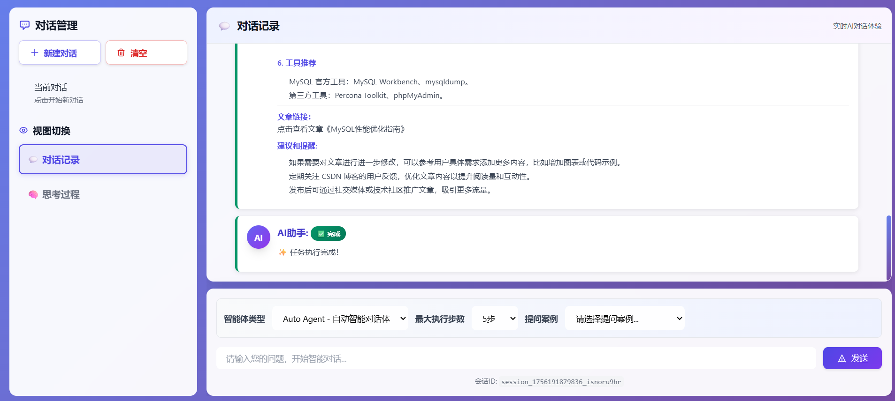

# 🤖 AI Agent 智能体综合平台

[](https://www.oracle.com/java/technologies/javase/javase-jdk17-downloads.html)
[](https://spring.io/projects/spring-boot)
[](https://spring.io/projects/spring-ai)
[](https://maven.apache.org/)



该系统是一套面向业务应用系统提效的综合智能体解决方案，基于 **Spring AI 1.0.0** 框架构建，支持动态多轮对话、可编排配置、智能任务调度等核心能力。通过 DDD 领域驱动设计 + 策略模式 + 责任链模式，实现了高度可扩展的 AI Agent 执行引擎，适用于代码评审、文档生成、系统巡检、智能分析等多种企业级应用场景。

------

## 🚀 项目亮点概览

- ✳ **动态多轮对话**：问题分析 → 自主规划 → 精准执行 → 质量监督，四阶段智能循环
- 🧠 **DDD 领域建模**：严格六层架构设计，领域逻辑与技术实现完全解耦
- 🧩 **可编排配置架构**：数据库驱动的组件装配，Model+Prompt+Advisor+MCP 自由组合
- ⛓ **责任链执行引擎**：四节点执行链路，每个节点独立配置不同能力组合
- 📦 **Spring Bean 动态注册**：热部署机制，无需重启即可调整 AI Agent 配置
- 🧱 **高扩展插件架构**：MCP 协议标准化，支持 stdio/sse 双模式工具调用

------

## 🏗️ 架构设计

| 模块层 | 说明 | 核心组件 |
| -------- | ------------------------------------------ | ------------------------------------------ |
| API 层 | 对外接口契约定义，服务间通信标准 | RESTful API、DTO 传输对象 |
| APP 层 | 应用启动入口，全局配置管理 | SpringBoot 启动类、配置类、Bean 装配 |
| Domain 层 | 核心业务逻辑，领域模型设计 | Entity、ValueObject、DomainService |
| Trigger 层 | 请求触发处理，事件监听 | Controller、EventListener、SSE |
| Infrastructure 层 | 基础设施实现，外部服务集成 | Repository、Gateway、MCP Client |
| Types 层 | 通用类型定义，枚举常量 | Enum、Constants、Common Types |

------

## 🛠 技术栈

| 层级 | 技术组件 | 版本/说明 |
| ---------- | --------------------------------------------- | --------------------------------------------- |
| 核心框架 | Spring Boot、Spring AI | 3.4.3 / 1.0.0 |
| 编程语言 | Java | 17 LTS |
| AI 集成 | ChatClient、OpenAI、Azure OpenAI | Spring AI 官方支持 |
| 工具协议 | MCP (Model Context Protocol) | stdio/sse 双模式 |
| 数据持久化 | MySQL、MyBatis | 8.0.28 / 3.0.4 |
| 向量数据库 | PGVector | RAG 知识库存储 |
| 缓存技术 | Redis | 分布式锁、配置缓存 |
| 消息处理 | SSE (Server-Sent Events) | 实时推送 |
| 工具库 | Fastjson、Guava、Commons Lang | 2.0.28 / 32.1.3-jre / 3.9 |
| 构建工具 | Maven | 多模块构建 |

------

## 🧩 核心设计模式

### ☑ 策略模式（Strategy Pattern）

- **执行策略工厂**：`DefaultAutoAgentExecuteStrategyFactory` 管理不同执行策略
- **装备策略工厂**：`DefaultArmoryStrategyFactory` 管理组件装配策略
- **数据加载策略**：`ILoadDataStrategy` 支持多种数据加载方式

```java
public interface StrategyHandler<T, C, R> {
    R apply(T entity, C context) throws Exception;
}
```

### ☑ 责任链模式（Chain of Responsibility）

- **四节点执行链**：RootNode → Step1AnalyzerNode → Step2PrecisionExecutorNode → Step3QualitySupervisorNode → Step4LogExecutionSummaryNode
- **动态路由机制**：每个节点根据执行结果决定下一个节点
- **链式组装分离**：执行逻辑与路由逻辑独立，增强灵活性

### ☑ 模板方法模式（Template Method）

```java
public abstract class AbstractExecuteSupport {
    public String process(ExecuteCommandEntity requestParameter, 
                         DynamicContext dynamicContext) throws Exception {
        doApply(requestParameter, dynamicContext);  // 子类实现
        return router(requestParameter, dynamicContext);
    }
    
    protected abstract String doApply(...) throws Exception;
}
```

### ☑ 工厂模式（Factory Pattern）

- **Spring Bean 动态工厂**：运行时创建和注册 ChatClient、Advisor、MCP 组件
- **组件装配工厂**：根据数据库配置动态组装 AI Agent 能力

------

## 🔁 核心执行链路设计

### 🎯 Step1: 任务分析节点（AnalyzerNode）

- 智能解析用户输入，提取关键信息和执行意图
- 调用专用分析模型，生成详细的任务执行计划
- 支持复杂任务的自动分解和优先级排序

### 🎯 Step2: 精准执行节点（PrecisionExecutorNode）

- 根据分析结果精确调用相应的 MCP 工具和服务
- 支持并行执行多个子任务，提升执行效率
- 实时监控执行状态，自动处理异常情况

### 🎯 Step3: 质量监督节点（QualitySupervisorNode）

- 智能评估执行结果的质量和完整性
- 支持多维度质量检查：准确性、完整性、规范性
- 不满足质量标准时自动触发重新执行

### 🎯 Step4: 执行总结节点（LogExecutionSummaryNode）

- 生成详细的执行报告和统计分析
- 支持 HTML 格式报告输出和实时推送
- 执行效率分析和优化建议生成

------

## 🧪 示例代码片段

```java
// Spring AI ChatClient 动态构建
ChatClient chatClient = ChatClient.builder(chatModel)
    .defaultSystem(systemPrompt)
    .defaultToolCallbacks(mcpToolCallbacks)
    .defaultAdvisors(
        PromptChatMemoryAdvisor.builder(
            MessageWindowChatMemory.builder()
                .maxMessages(100)
                .build()
        ).build(),
        new RagAnswerAdvisor(vectorStore, 
            SearchRequest.builder()
                .topK(5)
                .filterExpression("knowledge == 'tech-docs'")
                .build())
    )
    .build();
```

```java
// 责任链执行模式
@Override
public String process(ExecuteCommandEntity requestParameter, 
                     DynamicContext dynamicContext) throws Exception {
    // 执行当前节点逻辑
    String result = doApply(requestParameter, dynamicContext);
    
    // 路由到下一个节点
    StrategyHandler<?, ?, String> nextHandler = 
        get(requestParameter, dynamicContext);
    
    return nextHandler != null ? 
        nextHandler.apply(requestParameter, dynamicContext) : 
        "EXECUTION_COMPLETED";
}
```

```java
// MCP 工具动态注册
@Tool("Send WeChat notification")
public String sendWeChatNotification(
    @ToolParam("message content") String message,
    @ToolParam("target users") List<String> users) {
    return weChatService.sendMessage(message, users);
}
```

```java
// RAG 向量检索
SearchRequest searchRequest = SearchRequest.builder()
    .topK(5)
    .similarityThreshold(0.8)
    .filterExpression("domain == 'technical' AND language == 'zh'")
    .build();
    
List<Document> documents = vectorStore.similaritySearch(searchRequest);
```

------

## 🧰 MCP 工具生态

| 工具类型 | 功能描述 | 通信模式 | 应用场景 |
| ---------- | --------------------------------------------- | --------------------------------------------- | --------------------------------------------- |
| 微信通知 MCP | 企业微信/公众号消息推送 | SSE | 告警通知、报告分发 |
| CSDN 发布 MCP | 自动发布技术文章 | SSE | 内容创作、知识分享 |
| ELK 检索 MCP | Elasticsearch 日志查询 | SSE | 问题排查、日志分析 |
| Prometheus MCP | 监控指标查询分析 | SSE | 性能监控、系统巡检 |
| 文件系统 MCP | 本地文件操作 | stdio | 文件处理、代码分析 |
| GitHub MCP | 代码仓库操作 | SSE | 代码评审、PR 分析 |

------

## 📊 动态配置管理

### 🔧 数据库驱动配置

```sql
-- AI 智能体配置表
CREATE TABLE `ai_agent` (
    `id` bigint NOT NULL AUTO_INCREMENT,
    `ai_agent_id` varchar(64) NOT NULL COMMENT '智能体ID',
    `ai_agent_name` varchar(128) NOT NULL COMMENT '智能体名称',
    `status` tinyint(1) NOT NULL DEFAULT '1' COMMENT '状态',
    PRIMARY KEY (`id`)
);

-- AI 客户端配置表
CREATE TABLE `ai_client` (
    `client_id` varchar(64) NOT NULL,
    `client_name` varchar(128) NOT NULL,
    `model_bean_name` varchar(128) NOT NULL,
    `advisor_bean_name_list` json COMMENT '顾问Bean名称列表',
    `mcp_bean_name_list` json COMMENT 'MCP工具Bean名称列表',
    PRIMARY KEY (`client_id`)
);
```

### 🚀 热部署机制

```java
// 动态 Bean 注册
protected synchronized <T> void registerBean(String beanName, 
                                           Class<T> beanClass, 
                                           T beanInstance) {
    DefaultListableBeanFactory beanFactory = 
        (DefaultListableBeanFactory) applicationContext
            .getAutowireCapableBeanFactory();
    
    BeanDefinition beanDefinition = BeanDefinitionBuilder
        .genericBeanDefinition(beanClass, () -> beanInstance)
        .getBeanDefinition();
    
    beanFactory.registerBeanDefinition(beanName, beanDefinition);
    
    log.info("✅ 成功注册Bean: {}", beanName);
}
```

------

## ⚡ 性能优化特性

| 优化维度 | 实现方案 | 性能提升 |
| ---------- | --------------------------------------------- | --------------------------------------------- |
| 并发处理 | 自定义线程池 + 异步执行 | 支持千级并发 |
| 连接管理 | 模型API独立连接池 | 避免相互影响 |
| 缓存策略 | Redis 分布式缓存 | 响应时间提升80% |
| 向量检索 | HNSW 索引 + 查询优化 | 检索时间 < 50ms |
| 流式响应 | SSE + ResponseBodyEmitter | 实时用户体验 |
| 熔断降级 | 多模型备份切换 | 可用性99.9%+ |

------

## 📈 系统监控体系

### 📊 执行链路监控

```java
// 实时执行状态推送
sendSseResult(dynamicContext, 
    AutoAgentExecuteResultEntity.createStepResult(
        step, "step_start", 
        "🎯 开始执行任务分析", sessionId));

// 执行效率统计
double efficiency = dynamicContext.isCompleted() ? 100.0 : 
    ((double) actualSteps / maxSteps) * 100;
log.info("📊 执行效率: {:.1f}%", efficiency);
```

### 🔍 质量监控指标

- **任务完成率**：智能体成功完成任务的比例
- **执行效率**：平均执行步数与最大步数的比值
- **质量监督通过率**：质量检查一次性通过的比例
- **工具调用成功率**：MCP 工具调用的成功率统计

------

## 🔐 安全机制设计

| 安全层级 | 防护措施 | 实现方式 |
| ---------- | --------------------------------------------- | --------------------------------------------- |
| 接入层 | Nginx Token 校验 | JWT + 定期轮换 |
| 应用层 | API 密钥管理 | 独立密钥 + 二次验证 |
| 数据层 | 敏感信息加密 | AES-256 + RSA |
| 网络层 | HTTPS + 证书校验 | TLS 1.3 |
| 审计层 | 操作日志记录 | 全链路追踪 |
| 访问层 | 频率限制 + IP 白名单 | Redis 计数器 |

------

## 🎨 可视化编排界面

基于 React + flowgram.ai 框架实现拖拽式 AI Agent 编排：

- **节点化设计**：每个组件封装为可视化节点
- **实时预览**：配置变更即时生效
- **模板管理**：预设常用场景模板
- **版本控制**：配置历史版本管理
- **协作编辑**：多人同时编排支持

------

## 📌 典型应用场景

| 应用场景 | 技术实现 | 业务价值 |
| ---------- | --------------------------------------------- | --------------------------------------------- |
| 代码评审 Agent | GitHub MCP + 代码分析模型 | 评审时间从2小时缩短到15分钟 |
| 智能巡检 Agent | Prometheus + ELK MCP | 故障发现时间从小时级到分钟级 |
| 文档生成 Agent | 知识库RAG + 写作模型 | 月产出50+篇高质量文章 |
| 客服机器人 | 多轮对话 + 业务知识库 | 客户满意度提升35% |
| 数据分析 Agent | SQL工具 + 图表生成 | 分析报告自动化率90% |

------

## 🔮 技术发展路线

- 🧠 **多模态AI集成**：支持图片、音频、视频等多媒体处理能力
- 🌐 **分布式Agent协作**：多智能体协同工作机制
- 📱 **移动端支持**：iOS/Android 原生应用开发
- 🎯 **行业解决方案**：针对不同行业的专业化Agent模板
- 🔧 **低代码平台**：可视化Agent构建平台
- 🚀 **边缘计算部署**：支持边缘设备上的轻量级部署

------

如你对 AI Agent 智能体技术、Spring AI 框架应用、或企业级 AI 解决方案有兴趣，欢迎 Star 🌟、Fork 🍴 或提 PR 贡献！
